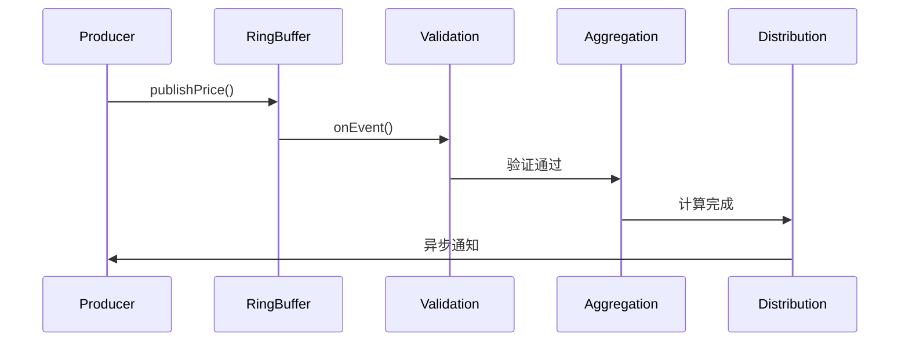

# LockFree Price Engine

> 基于LMAX Disruptor的无锁高频交易价格引擎实现

## 项目概述

本项目是一个高性能的无锁价格处理引擎，专为高频交易(HFT)场景设计。通过LMAX Disruptor框架实现完全无锁的并发架构，能够处理每秒百万级的价格更新，延迟控制在10微秒以内。

### 核心特性

- **🚀 极致性能**: 支持>100万TPS，端到端延迟<10μs
- **🔒 完全无锁**: 基于CAS和RingBuffer的无锁架构  
- **📊 高精度监控**: 集成HdrHistogram进行纳秒级延迟统计
- **⚡ CPU亲和性**: 支持线程绑定，减少上下文切换
- **🔧 灵活配置**: 多种等待策略和缓冲区大小配置

### 技术栈

- **Java 21**: 最新LTS版本，支持虚拟线程和模式匹配
- **LMAX Disruptor 3.4.4**: 高性能无锁环形队列
- **HdrHistogram 2.1.12**: 高精度延迟统计
- **Thread Affinity 3.23.1**: CPU亲和性控制
- **JMH 1.37**: 性能基准测试框架
- **Gradle 8.4**: 构建工具

## 快速开始

### 环境要求

- Java 21+
- Gradle 8.0+
- 内存: 建议4GB+

### 构建和运行

```bash
# 克隆项目
git clone <repository-url>
cd lock-free-price-engine

# 编译项目
./gradlew clean build

# 运行演示程序
./gradlew run

# 运行单元测试
./gradlew test

# 运行快速基准测试
./gradlew quickBenchmark

# 运行完整基准测试
./gradlew jmh
```

## 架构设计

### 整体架构

```
数据输入层      无锁通信层        事件处理链         监控层
┌─────────┐    ┌──────────┐    ┌─────────────┐    ┌─────────┐
│价格生产者│───▶│ Disruptor │───▶│验证│聚合│分发│───▶│延迟监控│
│ Threads │    │RingBuffer│    │Handler Chain│    │统计分析│
└─────────┘    └──────────┘    └─────────────┘    └─────────┘
```

### 核心组件

1. **PriceEvent**: 价格事件对象，在RingBuffer中循环使用
2. **ValidationHandler**: 价格数据验证处理器
3. **AggregationHandler**: 价格聚合和计算处理器  
4. **DistributionHandler**: 价格分发处理器
5. **LockFreePriceEngine**: 主引擎，协调所有组件

### 处理流程



## 性能基准测试

### 快速测试
```bash
./gradlew quickBenchmark
```

### 延迟测试
```bash
./gradlew latencyBenchmark
```

### 吞吐量测试
```bash
./gradlew throughputBenchmark
```

### 测试结果示例

| 测试项目 | 延迟(ns) | 吞吐量(ops/sec) | 备注 |
|---------|----------|----------------|------|
| 单次发布 | ~50 | 20M+ | 单线程 |
| 批量发布 | ~30 | 30M+ | 10个一批 |
| 价格查询 | ~10 | 100M+ | 无锁读取 |

## 使用示例

### 基础使用

```java
// 创建引擎
LockFreePriceEngine engine = new LockFreePriceEngine();

// 启动引擎
engine.start();

// 发布价格
boolean success = engine.publishPrice("EURUSD", 1.0999, 1.1001);

// 查询价格
var price = engine.getAggregationHandler().getLatestPrice("EURUSD");
System.out.println("Latest EURUSD: " + price);

// 关闭引擎
engine.shutdown();
```

### 自定义配置

```java
// 自定义RingBuffer大小和等待策略
WaitStrategy waitStrategy = new YieldingWaitStrategy();
LockFreePriceEngine engine = new LockFreePriceEngine(65536, waitStrategy);
```

### 性能监控

```java
// 获取统计信息
String stats = engine.getStatistics();
System.out.println(stats);

// 获取RingBuffer状态
String bufferStatus = engine.getRingBufferStatus();
System.out.println(bufferStatus);
```

## 配置选项

### 等待策略对比

| 策略 | 延迟 | CPU使用 | 适用场景 |
|------|------|---------|----------|
| BusySpinWaitStrategy | 最低 | 最高 | 超低延迟要求 |
| YieldingWaitStrategy | 低 | 高 | 平衡性能场景 |
| SleepingWaitStrategy | 中等 | 低 | 节能场景 |
| BlockingWaitStrategy | 高 | 最低 | 低频场景 |

### RingBuffer大小建议

- **16K**: 适合低延迟要求，内存友好
- **64K**: 平衡选择，适合大多数场景  
- **256K**: 高吞吐量场景，需要更多内存

## 性能调优

### JVM参数建议

```bash
-Xms2g -Xmx2g                          # 固定堆大小
-XX:+UseZGC                             # 使用ZGC低延迟垃圾收集器
-XX:MaxGCPauseMillis=1                  # 最大GC停顿1ms
-XX:+UnlockExperimentalVMOptions        # 启用实验性功能
--add-exports java.base/sun.misc=ALL-UNNAMED  # 允许访问内部API
```

### 系统级优化

1. **CPU亲和性**: 绑定关键线程到特定CPU核心
2. **NUMA优化**: 优化内存访问局部性
3. **网络中断**: 调整网络中断处理
4. **内核参数**: 优化内核调度参数

## 监控指标

### 核心KPI

- **延迟指标**: P50, P95, P99, P99.9延迟分布
- **吞吐量**: 每秒处理的价格更新数量
- **错误率**: 验证失败和处理异常比例
- **资源使用**: CPU使用率和内存占用

### 监控工具

- **HdrHistogram**: 高精度延迟统计
- **JVM指标**: GC停顿时间和频率
- **系统指标**: CPU、内存、网络使用情况

## 测试覆盖

### 单元测试
- 事件对象测试
- 处理器功能测试
- 引擎生命周期测试

### 集成测试  
- 端到端处理流程
- 并发安全性验证
- 异常处理测试

### 性能测试
- 延迟基准测试
- 吞吐量压力测试
- 长期稳定性测试

## 项目结构

```
src/
├── main/java/com/hft/lockfree/
│   ├── engine/          # 核心引擎
│   ├── event/           # 事件定义
│   ├── handler/         # 事件处理器
│   ├── monitor/         # 监控组件
│   └── util/            # 工具类
├── test/java/           # 单元测试
└── jmh/java/            # JMH基准测试
```

## 扩展开发

### 添加新的处理器

1. 实现`PriceEventHandler`接口
2. 在引擎中注册处理器
3. 配置处理链顺序

### 自定义等待策略

1. 继承Disruptor等待策略
2. 实现性能优化逻辑
3. 在引擎配置中使用

## 故障排除

### 常见问题

1. **内存不足**: 增加堆内存或减少RingBuffer大小
2. **GC停顿**: 调整GC参数或使用ZGC
3. **CPU占用高**: 调整等待策略或线程亲和性

### 调试工具

- JProfiler: 性能分析
- JConsole: JVM监控
- perf: 系统级性能分析

## 许可证

本项目采用MIT许可证 - 详见 [LICENSE](LICENSE) 文件

## 贡献指南

欢迎提交Issue和Pull Request！

## 相关文档

- [LMAX Disruptor官方文档](https://lmax-exchange.github.io/disruptor/)
- [Java内存模型详解](https://docs.oracle.com/javase/specs/jls/se21/html/jls-17.html)
- [JMH用户指南](https://github.com/openjdk/jmh)

---

**注意**: 本项目仅用于技术演示和学习目的，在生产环境使用前请进行充分的测试和评估。