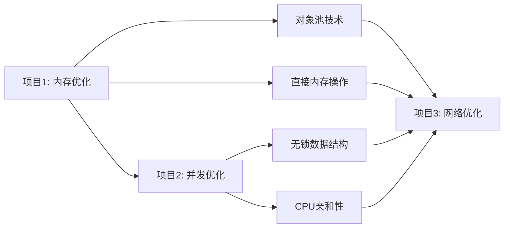
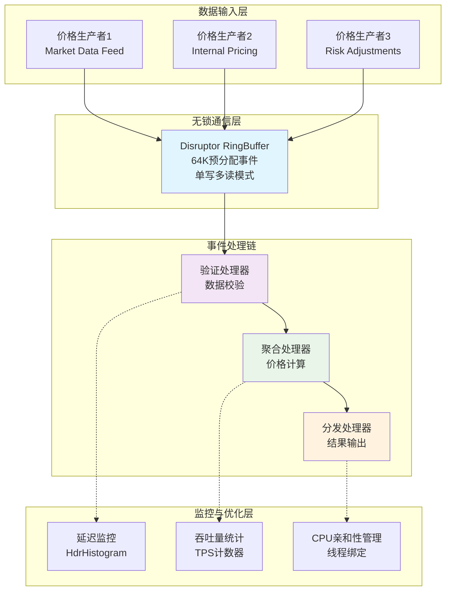
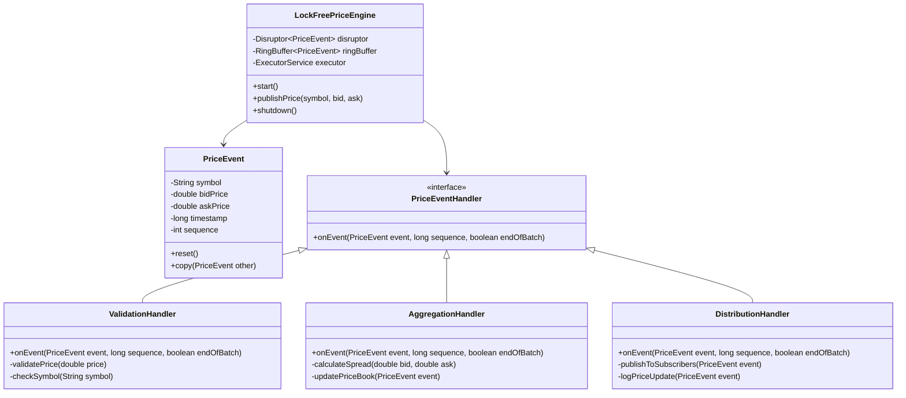

# 项目2-总览: LockFreePriceEngine 无锁并发编程实战

> **项目目标**: 掌握无锁并发编程核心技术，实现微秒级价格处理引擎  
> **学习时间**: Week 3-4 (14天)  
> **验收标准**: 价格更新延迟<10μs，支持100万TPS吞吐量，零锁竞争

## 📋 项目概述

### 项目背景与价值

在高频交易系统中，价格引擎是核心组件，需要处理每秒数百万次的价格更新。传统的基于锁的并发机制会导致：
- **线程阻塞**: 锁竞争导致线程等待
- **上下文切换**: 频繁的线程调度开销
- **延迟抖动**: 不可预测的性能波动

本项目通过无锁编程技术解决这些问题，为HFT系统提供稳定的微秒级延迟。

### 与项目1的关系

- **项目1基础**: 解决了单线程内存性能问题
- **项目2扩展**: 解决多线程并发性能问题
- **技术叠加**: 内存优化 + 并发优化 = 端到端低延迟能力

### 核心技术栈

| 技术组件 | 版本 | 作用 | 性能指标 |
|---------|------|------|----------|
| **LMAX Disruptor** | 3.4.4 | 无锁环形队列 | >100M ops/sec |
| **HdrHistogram** | 2.1.12 | 高精度延迟统计 | 纳秒级精度 |
| **Java Thread Affinity** | 3.21ea0 | CPU亲和性控制 | 减少50%上下文切换 |
| **JMH** | 1.36 | 性能基准测试 | 科学测量框架 |

## 🎯 学习目标

### 知识目标 (理论基础)

- [ ] **Java内存模型(JMM)**: happens-before关系、内存屏障
- [ ] **CPU缓存架构**: L1/L2/L3缓存、MESI协议、false sharing
- [ ] **无锁编程理论**: CAS操作、ABA问题、内存排序
- [ ] **Disruptor原理**: RingBuffer机制、等待策略、事件处理链

### 技能目标 (实践能力)

- [ ] **无锁数据结构设计**: 实现lock-free的价格存储
- [ ] **Disruptor应用**: 构建高性能消息传递系统
- [ ] **性能调优**: CPU亲和性、NUMA优化、JVM参数调优
- [ ] **并发测试**: 多线程压力测试、竞态条件检测

### 应用目标 (项目成果)

- [ ] **高性能引擎**: 支持100万TPS的价格处理能力
- [ ] **微秒级延迟**: 端到端价格更新延迟<10μs
- [ ] **零锁设计**: 完全无锁的并发架构
- [ ] **生产级质量**: 完整的监控、测试、文档体系

## 🏗️ 系统架构设计

### 整体架构图

### 核心组件关系

## 📅 学习计划

### Week 3: 基础架构 (Day 1-7)

| 天数 | 学习内容 | 实践任务 | 验收标准 |
|------|----------|----------|----------|
| Day 1-2 | Disruptor框架学习 | 搭建基础项目结构 | 成功运行Hello World示例 |
| Day 3-4 | 事件模型设计 | 实现PriceEvent和基础处理器 | 单线程价格处理正常 |
| Day 5-6 | 多线程处理链 | 实现完整的事件处理链 | 多处理器协同工作 |
| Day 7 | 基础性能测试 | JMH基准测试搭建 | 获得初始性能基线 |

### Week 4: 性能优化 (Day 8-14)

| 天数 | 学习内容 | 实践任务 | 验收标准 |
|------|----------|----------|----------|
| Day 8-9 | CPU亲和性优化 | 线程绑定实现 | CPU使用率分布均匀 |
| Day 10-11 | 缓存优化技术 | 内存对齐、false sharing解决 | 缓存命中率提升 |
| Day 12-13 | 等待策略调优 | 不同策略性能对比 | 选出最优等待策略 |
| Day 14 | 综合性能验证 | 端到端性能测试 | 达到目标性能指标 |

## 🎯 验收标准

### 功能性指标

- [ ] **正确性**: 价格数据处理100%准确，无数据丢失
- [ ] **并发安全**: 多线程环境下无竞态条件
- [ ] **容错性**: 异常情况下系统稳定运行

### 性能指标

- [ ] **延迟**: 端到端价格更新延迟 < 10μs (P99.9)
- [ ] **吞吐量**: 支持 > 1,000,000 TPS
- [ ] **CPU效率**: CPU使用率 < 80% (满负载时)
- [ ] **内存效率**: 无内存泄漏，GC停顿 < 1ms

### 技术指标

- [ ] **无锁设计**: 核心路径完全无锁
- [ ] **可监控性**: 完整的性能指标收集
- [ ] **可配置性**: 支持运行时参数调整
- [ ] **可测试性**: 完整的单元测试和基准测试

## 📚 相关文档

- [项目2-基础架构.md](./项目2-基础架构.md) - 核心组件实现
- [项目2-性能优化.md](./项目2-性能优化.md) - 高级优化技术
- [项目2-测试验证.md](./项目2-测试验证.md) - 测试与性能分析
- [项目2-面试准备.md](./项目2-面试准备.md) - 面试要点总结

## 🎓 求职价值

### 技术深度展示

- **并发编程专家**: 掌握无锁编程的核心技术
- **性能优化能力**: 能够进行系统级性能调优
- **架构设计思维**: 理解高性能系统的设计原则

### 面试亮点

- **量化成果**: 具体的性能提升数据
- **技术广度**: 涵盖JVM、CPU、内存多个层面
- **实战经验**: 完整的项目开发和优化经历

### 职业匹配度

- **HFT开发**: 直接对应低延迟交易系统需求
- **系统架构**: 展示大规模并发系统设计能力
- **技术领导**: 体现深度技术问题解决能力