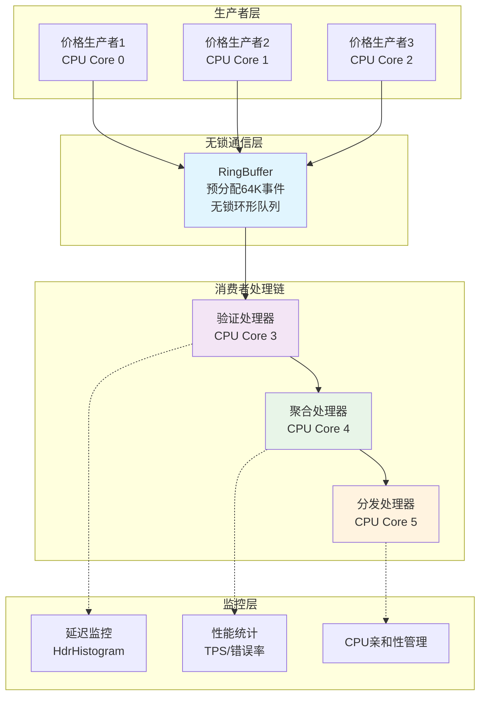
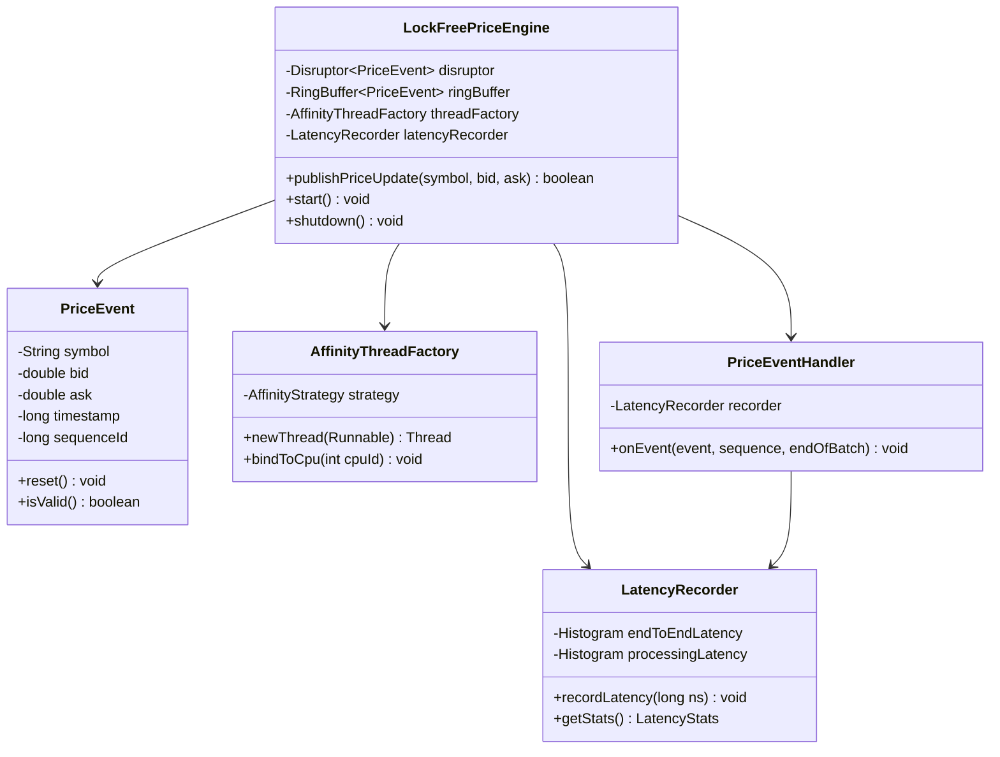

# 项目2: LockFreePriceEngine - 无锁并发编程实战

> **目标**: 掌握无锁并发编程核心技术，实现微秒级价格处理引擎  
> **时间**: Week 3-4 (14天)  
> **验收标准**: 价格更新延迟<10μs，支持100万TPS吞吐量，零锁竞争

## 📋 项目概述

### 项目背景

基于项目1的内存优化基础，项目2专注于并发编程优化。在高频交易系统中，价格引擎需要处理每秒数百万次的价格更新，传统的基于锁的并发机制会导致线程阻塞和上下文切换，严重影响延迟性能。

### 与项目1的关系

- **项目1**: 解决了单线程内存性能问题（对象池、直接内存、GC优化）
- **项目2**: 解决多线程并发性能问题（无锁编程、CPU亲和性、缓存优化）
- **结合效果**: 端到端的低延迟Java应用能力

### 核心技术栈

1. **LMAX Disruptor**: 高性能无锁环形队列
2. **CPU亲和性**: 线程绑定到特定CPU核心
3. **内存屏障**: 确保内存操作的顺序性和可见性
4. **缓存行对齐**: 避免false sharing
5. **HdrHistogram**: 高精度延迟统计

## 🎯 学习目标

### 知识目标

- [ ] 理解Java内存模型(JMM)和happens-before关系
- [ ] 掌握CAS操作、volatile关键字、原子类的原理
- [ ] 理解CPU缓存层次结构和MESI协议
- [ ] 掌握Disruptor的RingBuffer机制

### 技能目标

- [ ] 能够设计和实现无锁数据结构
- [ ] 能够使用Disruptor构建高性能消息系统
- [ ] 能够进行CPU亲和性设置和NUMA优化
- [ ] 能够识别和解决并发性能瓶颈

### 应用目标

- [ ] 完成支持百万TPS的价格引擎
- [ ] 实现微秒级的价格更新延迟
- [ ] 建立完整的并发性能测试体系

## 🏗️ 系统架构设计

### 整体架构图

### 核心组件关系

## 📅 14天实施计划

### Week 3: 无锁编程基础 (Day 1-7)

#### **Day 1-2: Disruptor框架深入**

**学习重点**:

- Disruptor vs 传统队列性能对比
- RingBuffer的内存预分配机制
- 事件发布和消费的生命周期

**核心任务**:

- [ ] 搭建Disruptor开发环境
- [ ] 实现第一个价格事件处理器
- [ ] 对比ArrayBlockingQueue vs RingBuffer性能

#### **Day 3-4: 等待策略与CPU优化**

**学习重点**:

- YieldingWaitStrategy vs SleepingWaitStrategy
- CPU亲和性设置和NUMA感知
- 忙等待 vs 阻塞等待的权衡

**核心任务**:

- [ ] 实现CPU亲和性线程工厂
- [ ] 测试不同等待策略的延迟影响
- [ ] 优化线程到CPU核心的绑定

#### **Day 5-7: 内存屏障与缓存优化**

**学习重点**:

- volatile关键字和内存可见性
- False sharing问题识别和解决
- @Contended注解的使用

**核心任务**:

- [ ] 实现缓存行对齐的数据结构
- [ ] 验证false sharing对性能的影响
- [ ] 使用JOL工具分析对象内存布局

### Week 4: 完整引擎实现 (Day 8-14)

#### **Day 8-10: 价格引擎核心实现**

**学习重点**:

- 事件处理链的设计模式
- 多阶段处理的延迟优化
- 批处理vs实时处理权衡

**核心任务**:

- [ ] 实现完整的LockFreePriceEngine
- [ ] 设计验证→聚合→分发的处理链
- [ ] 集成延迟监控和性能统计

#### **Day 11-12: 多生产者支持**

**学习重点**:

- 多生产者模式的序列号分配
- 生产者间的协调机制
- 批量发布优化

**核心任务**:

- [ ] 扩展引擎支持多个价格源
- [ ] 实现生产者注册和管理
- [ ] 优化批量价格更新性能

#### **Day 13-14: 性能测试与优化**

**学习重点**:

- JMH基准测试最佳实践
- 性能瓶颈识别和调优
- 生产环境部署考虑

**核心任务**:

- [ ] 完成全面的性能基准测试
- [ ] 压力测试和稳定性验证
- [ ] 撰写性能分析报告

## 📊 关键性能指标

### 延迟性能目标

|指标|目标值|测量方法|
|---|---|---|
|P50延迟|< 2μs|HdrHistogram|
|P99延迟|< 10μs|HdrHistogram|
|P99.9延迟|< 50μs|HdrHistogram|

### 吞吐量性能目标

|场景|目标TPS|测量方法|
|---|---|---|
|单生产者|> 1,000,000|JMH基准测试|
|多生产者|> 500,000|并发测试|
|批量处理|> 2,000,000|批量基准测试|

### 资源使用目标

|资源|目标值|监控方法|
|---|---|---|
|CPU利用率|< 80%|top/htop|
|内存增长|< 10MB/小时|JVM监控|
|GC停顿|< 1ms|GC日志|

## 🎯 面试价值分析

### 技术深度展示

这个项目能够展示以下高级技能：

#### **1. 并发编程专家级能力**

- 深入理解Java内存模型
- 熟练使用无锁数据结构
- 掌握CPU级别的性能优化

#### **2. 系统性能调优能力**

- 能够进行微秒级延迟优化
- 理解硬件和软件的相互影响
- 具备生产环境性能诊断能力

#### **3. 高频交易领域知识**

- 理解价格处理的业务需求
- 掌握金融系统的性能要求
- 具备实时系统设计经验

### 对应Job Specs要求

- **Barclays要求**: "mechanical sympathy" ✅
- **SGX要求**: "低延迟多线程应用" ✅
- **通用要求**: "并发编程和性能调优" ✅

## 📚 学习资源清单

### 必读书籍

1. **《Java Concurrency in Practice》** - Brian Goetz
2. **《The Art of Multiprocessor Programming》** - Maurice Herlihy
3. **《Systems Performance》** - Brendan Gregg (并发部分)

### 在线资源

- **LMAX Disruptor GitHub**: https://github.com/LMAX-Exchange/disruptor
- **Martin Thompson博客**: https://mechanical-sympathy.blogspot.com/
- **OpenHFT项目**: https://github.com/OpenHFT

### 工具和库

- **HdrHistogram**: 高精度延迟统计
- **JOL**: Java对象布局分析工具
- **async-profiler**: 低开销性能分析器

## 🚀 后续文档导航

项目2采用模块化学习结构，按照技术层次和学习进度划分：

### 📚 学习模块

1. **[[项目2-总览]]** - 项目背景、目标与整体架构
2. **[[项目2-基础架构]]** - 核心组件实现与Disruptor集成
3. **[[项目2-性能优化]]** - 高级优化技术与内存管理
4. **[[项目2-测试验证]]** - 性能基准测试与系统验证
5. **[[项目2-面试准备]]** - 技术要点总结与面试指导

### 🎯 学习路径建议

**第一阶段（1-3天）：** 总览 → 基础架构  
**第二阶段（4-8天）：** 性能优化 → 测试验证  
**第三阶段（9-14天）：** 面试准备 → 项目整合

---

**准备好深入无锁编程的世界了吗？**

让我们从 **[[项目2-总览]]** 开始系统学习！🚀