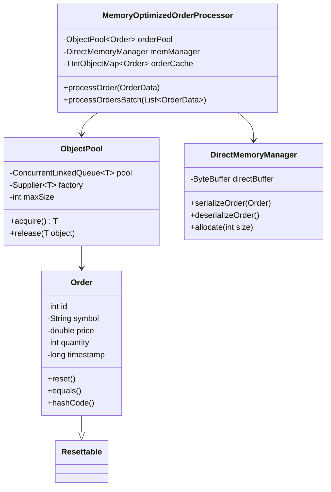

# 项目1: MemoryOptimizedOrderProcessor

> **目标**: 掌握Java内存优化核心技术，实现微秒级订单处理性能  
> **时间**: Week 1-2 (14天)  
> **验收标准**: 对象池性能比new操作提升3-5倍，GC停顿时间减少50%

## 📋 项目概述

### 项目背景

在高频交易系统中，每微秒的延迟都可能导致巨大的财务损失。传统的Java对象创建和垃圾回收机制在高频场景下会成为性能瓶颈。本项目通过实现高性能的内存管理机制，为后续的低延迟交易系统打下基础。

### 核心价值

- **技能价值**: 掌握Java性能优化的核心技术
- **面试价值**: 能够深入讲解JVM内存模型和优化策略
- **实战价值**: 为后续项目提供高性能的基础组件

### 技术关键点

1. **对象池模式**: 避免频繁的对象创建和销毁
2. **直接内存操作**: 减少堆内存分配，降低GC压力
3. **原始类型集合**: 避免装箱拆箱开销
4. **字符串优化**: 减少字符串对象创建
5. **JMH基准测试**: 科学地测量性能改进

## 🎯 学习目标

### 知识目标

- [ ] 理解JVM内存模型（堆、栈、方法区、直接内存）
- [ ] 掌握垃圾收集器的工作原理和调优参数
- [ ] 理解对象生命周期和内存分配机制
- [ ] 掌握JMH基准测试框架的使用

### 技能目标

- [ ] 能够实现高性能的对象池
- [ ] 能够使用直接内存进行高效数据操作
- [ ] 能够选择合适的数据结构优化性能
- [ ] 能够编写和解读性能基准测试

### 应用目标

- [ ] 完成高性能订单处理器实现
- [ ] 获得可量化的性能提升数据
- [ ] 建立性能测试和分析的方法论

## 🏗️ 项目架构

### 核心组件设计

```
MemoryOptimizedOrderProcessor
├── ObjectPool<T>              # 通用对象池
├── Order                      # 优化的订单对象
├── DirectMemoryManager        # 直接内存管理
├── OrderCache                 # 高性能订单缓存
└── PerformanceBenchmark       # JMH性能测试
```

### 类关系图



## 📅 详细实施计划

### Week 1: 基础组件开发

#### **Day 1: 环境搭建和项目初始化**

**学习内容**:

- Maven项目结构设计
- JMH基准测试框架配置
- Git仓库和CI/CD设置

**开发任务**:

```bash
# 1. 创建Maven项目
mvn archetype:generate \
  -DgroupId=com.hft.memory \
  -DartifactId=memory-optimization \
  -DarchetypeArtifactId=maven-archetype-quickstart

# 2. 配置pom.xml依赖
# 3. 创建包结构
# 4. 设置IDE配置
```

**验收标准**:

- [ ] Maven项目可以正常编译运行
- [ ] JMH插件配置正确
- [ ] Git仓库创建并完成首次提交

#### **Day 2-3: 对象池实现**

**学习内容**:

- 对象池设计模式原理
- Java并发集合的选择
- 对象重用和重置策略

**核心代码实现**:

```java
public class ObjectPool<T> {
    private final ConcurrentLinkedQueue<T> pool;
    private final Supplier<T> factory;
    private final int maxSize;
    private final AtomicInteger currentSize;
    
    public ObjectPool(Supplier<T> factory, int maxSize) {
        this.factory = factory;
        this.maxSize = maxSize;
        this.pool = new ConcurrentLinkedQueue<>();
        this.currentSize = new AtomicInteger(0);
        
        // 预热对象池
        for (int i = 0; i < maxSize / 2; i++) {
            pool.offer(factory.get());
            currentSize.incrementAndGet();
        }
    }
    
    public T acquire() {
        T object = pool.poll();
        if (object != null) {
            currentSize.decrementAndGet();
            return object;
        }
        // 池中无对象，创建新对象
        return factory.get();
    }
    
    public void release(T object) {
        if (object == null) return;
        
        // 重置对象状态
        if (object instanceof Resettable) {
            ((Resettable) object).reset();
        }
        
        // 如果池未满，归还对象
        if (currentSize.get() < maxSize) {
            pool.offer(object);
            currentSize.incrementAndGet();
        }
        // 否则让GC回收
    }
    
    public int size() {
        return currentSize.get();
    }
}

interface Resettable {
    void reset();
}
```

**验收标准**:

- [ ] 对象池线程安全性测试通过
- [ ] 内存泄漏测试通过（长时间运行）
- [ ] 性能基准测试显示明显提升

#### **Day 4-5: Order对象优化**

**学习内容**:

- 对象内存布局优化
- String intern和常量池
- equals/hashCode高性能实现

**核心代码实现**:

```java
public class Order implements Resettable {
    // 使用更紧凑的数据类型
    private int id;                    // 4 bytes
    private volatile long priceAndQty; // 8 bytes (price: 高32位, qty: 低32位)
    private long timestamp;            // 8 bytes
    private byte side;                 // 1 byte (BUY=1, SELL=2)
    private byte type;                 // 1 byte (MARKET=1, LIMIT=2)
    
    // 使用常量字符串，避免重复创建
    private static final String[] COMMON_SYMBOLS = {
        "EURUSD", "GBPUSD", "USDJPY", "AUDUSD", "USDCAD"
    };
    private byte symbolIndex = -1;     // 索引到常量数组
    private String customSymbol;       // 非常用品种
    
    public Order() {}
    
    // 高性能构造器
    public Order(int id, String symbol, double price, int quantity) {
        this.id = id;
        setSymbol(symbol);
        setPriceAndQuantity(price, quantity);
        this.timestamp = System.nanoTime();
        this.side = 1; // BUY
        this.type = 2; // LIMIT
    }
    
    // 位操作优化：将price和quantity打包到一个long中
    private void setPriceAndQuantity(double price, int quantity) {
        long priceBits = Double.doubleToRawLongBits(price);
        this.priceAndQty = (priceBits & 0xFFFFFFFF00000000L) | 
                          (quantity & 0xFFFFFFFFL);
    }
    
    public double getPrice() {
        long priceBits = priceAndQty & 0xFFFFFFFF00000000L;
        return Double.longBitsToDouble(priceBits);
    }
    
    public int getQuantity() {
        return (int) (priceAndQty & 0xFFFFFFFFL);
    }
    
    // 符号优化：常用符号用索引，减少String对象
    public void setSymbol(String symbol) {
        for (int i = 0; i < COMMON_SYMBOLS.length; i++) {
            if (COMMON_SYMBOLS[i].equals(symbol)) {
                this.symbolIndex = (byte) i;
                this.customSymbol = null;
                return;
            }
        }
        this.symbolIndex = -1;
        this.customSymbol = symbol.intern(); // 使用字符串池
    }
    
    public String getSymbol() {
        return symbolIndex >= 0 ? 
               COMMON_SYMBOLS[symbolIndex] : 
               customSymbol;
    }
    
    @Override
    public void reset() {
        this.id = 0;
        this.priceAndQty = 0L;
        this.timestamp = 0L;
        this.side = 1;
        this.type = 2;
        this.symbolIndex = -1;
        this.customSymbol = null;
    }
    
    // 高性能equals/hashCode
    @Override
    public boolean equals(Object obj) {
        if (this == obj) return true;
        if (!(obj instanceof Order)) return false;
        Order other = (Order) obj;
        return this.id == other.id; // 假设ID唯一
    }
    
    @Override
    public int hashCode() {
        return id; // 简单高效的hash
    }
    
    // 高性能toString，使用StringBuilder
    private static final ThreadLocal<StringBuilder> STRING_BUILDER = 
        ThreadLocal.withInitial(() -> new StringBuilder(128));
    
    @Override
    public String toString() {
        StringBuilder sb = STRING_BUILDER.get();
        sb.setLength(0); // 重置而不是new
        
        return sb.append("Order{id=").append(id)
                 .append(", symbol='").append(getSymbol())
                 .append("', price=").append(getPrice())
                 .append(", qty=").append(getQuantity())
                 .append(", side=").append(side == 1 ? "BUY" : "SELL")
                 .append('}').toString();
    }
    
    // Getters and Setters...
    public int getId() { return id; }
    public void setId(int id) { this.id = id; }
    
    public long getTimestamp() { return timestamp; }
    public void setTimestamp(long timestamp) { this.timestamp = timestamp; }
    
    public byte getSide() { return side; }
    public void setSide(byte side) { this.side = side; }
    
    public byte getType() { return type; }
    public void setType(byte type) { this.type = type; }
}
```

**验收标准**:

- [ ] 对象内存占用减少30%以上
- [ ] equals/hashCode性能测试通过
- [ ] 字符串操作性能提升显著

#### **Day 6-7: 直接内存管理**

**学习内容**:

- 堆内存 vs 直接内存的区别
- ByteBuffer的高效使用
- 序列化性能优化

**核心代码实现**:

```java
public class DirectMemoryManager {
    private final ByteBuffer directBuffer;
    private final int bufferSize;
    private volatile int position;
    
    // 订单序列化固定长度
    private static final int ORDER_SERIALIZED_SIZE = 64;
    
    public DirectMemoryManager(int bufferSize) {
        this.bufferSize = bufferSize;
        this.directBuffer = ByteBuffer.allocateDirect(bufferSize);
        this.position = 0;
    }
    
    // 高性能订单序列化
    public boolean serializeOrder(Order order) {
        if (directBuffer.remaining() < ORDER_SERIALIZED_SIZE) {
            return false; // 缓冲区已满
        }
        
        // 使用相对位置操作，避免position的同步开销
        int startPos = position;
        
        directBuffer.putInt(startPos, order.getId());
        directBuffer.putLong(startPos + 4, 
            Double.doubleToRawLongBits(order.getPrice()));
        directBuffer.putInt(startPos + 12, order.getQuantity());
        directBuffer.putLong(startPos + 16, order.getTimestamp());
        directBuffer.put(startPos + 24, order.getSide());
        directBuffer.put(startPos + 25, order.getType());
        
        // 符号序列化（最多32字节）
        String symbol = order.getSymbol();
        byte[] symbolBytes = symbol.getBytes(StandardCharsets.UTF_8);
        int symbolLength = Math.min(symbolBytes.length, 31);
        directBuffer.put(startPos + 26, (byte) symbolLength);
        directBuffer.put(startPos + 27, symbolBytes, 0, symbolLength);
        
        // 更新位置
        position += ORDER_SERIALIZED_SIZE;
        return true;
    }
    
    // 高性能订单反序列化
    public Order deserializeOrder(Order reusableOrder, int offset) {
        if (offset + ORDER_SERIALIZED_SIZE > position) {
            return null; // 越界
        }
        
        reusableOrder.setId(directBuffer.getInt(offset));
        
        double price = Double.longBitsToDouble(
            directBuffer.getLong(offset + 4));
        int quantity = directBuffer.getInt(offset + 12);
        reusableOrder.setPriceAndQuantity(price, quantity);
        
        reusableOrder.setTimestamp(directBuffer.getLong(offset + 16));
        reusableOrder.setSide(directBuffer.get(offset + 24));
        reusableOrder.setType(directBuffer.get(offset + 25));
        
        // 符号反序列化
        int symbolLength = directBuffer.get(offset + 26) & 0xFF;
        byte[] symbolBytes = new byte[symbolLength];
        directBuffer.get(offset + 27, symbolBytes, 0, symbolLength);
        String symbol = new String(symbolBytes, StandardCharsets.UTF_8);
        reusableOrder.setSymbol(symbol);
        
        return reusableOrder;
    }
    
    // 批量序列化
    public int serializeOrderBatch(List<Order> orders) {
        int serializedCount = 0;
        for (Order order : orders) {
            if (serializeOrder(order)) {
                serializedCount++;
            } else {
                break; // 缓冲区已满
            }
        }
        return serializedCount;
    }
    
    // 重置缓冲区
    public void reset() {
        position = 0;
        directBuffer.clear();
    }
    
    // 获取已使用大小
    public int getUsedSize() {
        return position;
    }
    
    // 获取剩余空间
    public int getRemainingSize() {
        return bufferSize - position;
    }
}
```

**验收标准**:

- [ ] 序列化性能比Java原生序列化快10倍以上
- [ ] 直接内存操作无内存泄漏
- [ ] 批量操作性能线性提升

### Week 2: 性能优化和测试

#### **Day 8-9: 高性能数据结构**

**学习内容**:

- Trove原始类型集合库
- 缓存友好的数据结构设计
- 避免装箱拆箱的技巧

**核心代码实现**:

```java
import gnu.trove.map.TIntObjectMap;
import gnu.trove.map.hash.TIntObjectHashMap;
import gnu.trove.list.TIntList;
import gnu.trove.list.array.TIntArrayList;

public class OrderCache {
    // 使用原始类型Map，避免Integer装箱
    private final TIntObjectMap<Order> orderById;
    private final Map<String, TIntList> ordersBySymbol;
    
    // 预分配容量，减少rehash
    private static final int INITIAL_CAPACITY = 100000;
    private static final float LOAD_FACTOR = 0.75f;
    
    public OrderCache() {
        this.orderById = new TIntObjectHashMap<>(INITIAL_CAPACITY, LOAD_FACTOR);
        this.ordersBySymbol = new ConcurrentHashMap<>(100); // 假设100个交易品种
    }
    
    // 高性能订单添加
    public void addOrder(Order order) {
        // 原始类型操作，无装箱开销
        orderById.put(order.getId(), order);
        
        // 按品种分组
        String symbol = order.getSymbol();
        ordersBySymbol.computeIfAbsent(symbol, 
            k -> new TIntArrayList()).add(order.getId());
    }
    
    // 高性能查找
    public Order getOrder(int orderId) {
        return orderById.get(orderId); // 无装箱
    }
    
    // 按品种查找订单
    public List<Order> getOrdersBySymbol(String symbol) {
        TIntList orderIds = ordersBySymbol.get(symbol);
        if (orderIds == null) {
            return Collections.emptyList();
        }
        
        List<Order> orders = new ArrayList<>(orderIds.size());
        orderIds.forEach(orderId -> {
            Order order = orderById.get(orderId);
            if (order != null) {
                orders.add(order);
            }
            return true; // 继续遍历
        });
        
        return orders;
    }
    
    // 高性能订单移除
    public Order removeOrder(int orderId) {
        Order order = orderById.remove(orderId);
        if (order != null) {
            String symbol = order.getSymbol();
            TIntList symbolOrders = ordersBySymbol.get(symbol);
            if (symbolOrders != null) {
                symbolOrders.remove(orderId);
                if (symbolOrders.isEmpty()) {
                    ordersBySymbol.remove(symbol);
                }
            }
        }
        return order;
    }
    
    // 缓存统计
    public void printStats() {
        System.out.printf("Total orders: %d%n", orderById.size());
        System.out.printf("Symbols: %d%n", ordersBySymbol.size());
        
        // 内存使用情况
        long memoryUsed = orderById.size() * 64; // 估算每个订单64字节
        System.out.printf("Estimated memory: %.2f MB%n", memoryUsed / 1024.0 / 1024.0);
    }
    
    public int size() {
        return orderById.size();
    }
    
    public void clear() {
        orderById.clear();
        ordersBySymbol.clear();
    }
}
```

**验收标准**:

- [ ] 原始类型集合性能比Java Collections快30%以上
- [ ] 内存占用减少25%以上
- [ ] 大数据量操作(100万订单)性能稳定

#### **Day 10-11: 主处理器实现**

**学习内容**:

- 组件整合和协调
- 批处理优化技巧
- 异常处理和资源管理

**核心代码实现**:

```java
public class MemoryOptimizedOrderProcessor {
    // 核心组件
    private final ObjectPool<Order> orderPool;
    private final DirectMemoryManager memoryManager;
    private final OrderCache orderCache;
    
    // 性能统计
    private final AtomicLong processedCount = new AtomicLong(0);
    private final AtomicLong totalProcessingTime = new AtomicLong(0);
    
    // 批处理配置
    private static final int BATCH_SIZE = 1000;
    private static final int MEMORY_BUFFER_SIZE = 64 * 1024 * 1024; // 64MB
    
    public MemoryOptimizedOrderProcessor() {
        this.orderPool = new ObjectPool<>(Order::new, 10000);
        this.memoryManager = new DirectMemoryManager(MEMORY_BUFFER_SIZE);
        this.orderCache = new OrderCache();
    }
    
    // 单个订单处理（优化版）
    public ProcessingResult processOrder(OrderData orderData) {
        long startTime = System.nanoTime();
        
        Order order = orderPool.acquire();
        try {
            // 数据转换
            order.setId(orderData.getId());
            order.setSymbol(orderData.getSymbol());
            order.setPrice(orderData.getPrice());
            order.setQuantity(orderData.getQuantity());
            order.setSide(orderData.getSide());
            order.setTimestamp(startTime);
            
            // 业务处理
            validateOrder(order);
            orderCache.addOrder(order);
            
            // 序列化到直接内存
            boolean serialized = memoryManager.serializeOrder(order);
            
            // 统计更新
            processedCount.incrementAndGet();
            long processingTime = System.nanoTime() - startTime;
            totalProcessingTime.addAndGet(processingTime);
            
            return new ProcessingResult(true, processingTime, serialized);
            
        } catch (Exception e) {
            return new ProcessingResult(false, System.nanoTime() - startTime, false, e);
        } finally {
            orderPool.release(order);
        }
    }
    
    // 批量订单处理（高性能版）
    public BatchProcessingResult processOrdersBatch(List<OrderData> orderDataList) {
        if (orderDataList.isEmpty()) {
            return new BatchProcessingResult(0, 0, 0);
        }
        
        long startTime = System.nanoTime();
        int successCount = 0;
        int failureCount = 0;
        List<Order> orderBatch = new ArrayList<>(BATCH_SIZE);
        
        try {
            // 批量获取订单对象
            for (int i = 0; i < orderDataList.size(); i++) {
                Order order = orderPool.acquire();
                orderBatch.add(order);
            }
            
            // 批量数据转换
            for (int i = 0; i < orderDataList.size(); i++) {
                OrderData data = orderDataList.get(i);
                Order order = orderBatch.get(i);
                
                try {
                    order.setId(data.getId());
                    order.setSymbol(data.getSymbol());
                    order.setPrice(data.getPrice());
                    order.setQuantity(data.getQuantity());
                    order.setSide(data.getSide());
                    order.setTimestamp(System.nanoTime());
                    
                    validateOrder(order);
                    orderCache.addOrder(order);
                    successCount++;
                    
                } catch (Exception e) {
                    failureCount++;
                    // 记录错误但继续处理其他订单
                }
            }
            
            // 批量序列化
            int serializedCount = memoryManager.serializeOrderBatch(orderBatch);
            
            // 批量统计更新
            processedCount.addAndGet(successCount);
            long totalTime = System.nanoTime() - startTime;
            totalProcessingTime.addAndGet(totalTime);
            
            return new BatchProcessingResult(successCount, failureCount, 
                                           totalTime, serializedCount);
            
        } finally {
            // 批量归还对象
            for (Order order : orderBatch) {
                if (order != null) {
                    orderPool.release(order);
                }
            }
        }
    }
    
    // 订单验证
    private void validateOrder(Order order) {
        if (order.getPrice() <= 0) {
            throw new IllegalArgumentException("Invalid price: " + order.getPrice());
        }
        if (order.getQuantity() <= 0) {
            throw new IllegalArgumentException("Invalid quantity: " + order.getQuantity());
        }
        if (order.getSymbol() == null || order.getSymbol().isEmpty()) {
            throw new IllegalArgumentException("Invalid symbol");
        }
    }
    
    // 性能统计
    public PerformanceStats getPerformanceStats() {
        long count = processedCount.get();
        long totalTime = totalProcessingTime.get();
        
        double avgLatencyNs = count > 0 ? (double) totalTime / count : 0;
        double throughputPerSec = count > 0 ? count * 1_000_000_000.0 / totalTime : 0;
        
        return new PerformanceStats(count, avgLatencyNs, throughputPerSec, 
                                  orderCache.size(), orderPool.size());
    }
    
    // 资源清理
    public void shutdown() {
        orderCache.clear();
        memoryManager.reset();
        // 对象池会自动清理
    }
    
    // 内存状态检查
    public MemoryStatus getMemoryStatus() {
        Runtime runtime = Runtime.getRuntime();
        long totalMemory = runtime.totalMemory();
        long freeMemory = runtime.freeMemory();
        long usedMemory = totalMemory - freeMemory;
        
        return new MemoryStatus(
            usedMemory,
            totalMemory,
            memoryManager.getUsedSize(),
            memoryManager.getRemainingSize()
        );
    }
}

// 数据传输对象
class OrderData {
    private final int id;
    private final String symbol;
    private final double price;
    private final int quantity;
    private final byte side;
    
    public OrderData(int id, String symbol, double price, int quantity, byte side) {
        this.id = id;
        this.symbol = symbol;
        this.price = price;
        this.quantity = quantity;
        this.side = side;
    }
    
    // Getters...
    public int getId() { return id; }
    public String getSymbol() { return symbol; }
    public double getPrice() { return price; }
    public int getQuantity() { return quantity; }
    public byte getSide() { return side; }
}

// 结果对象
class ProcessingResult {
    private final boolean success;
    private final long processingTimeNs;
    private final boolean serialized;
    private final Exception error;
    
    public ProcessingResult(boolean success, long processingTimeNs, boolean serialized) {
        this(success, processingTimeNs, serialized, null);
    }
    
    public ProcessingResult(boolean success, long processingTimeNs, 
                          boolean serialized, Exception error) {
        this.success = success;
        this.processingTimeNs = processingTimeNs;
        this.serialized = serialized;
        this.error = error;
    }
    
    // Getters...
    public boolean isSuccess() { return success; }
    public long getProcessingTimeNs() { return processingTimeNs; }
    public boolean isSerialized() { return serialized; }
    public Exception getError() { return error; }
}

class BatchProcessingResult {
    private final int successCount;
    private final int failureCount;
    private final long totalTimeNs;
    private final int serializedCount;
    
    public BatchProcessingResult(int successCount, int failureCount, 
                               long totalTimeNs, int serializedCount) {
        this.successCount = successCount;
        this.failureCount = failureCount;
        this.totalTimeNs = totalTimeNs;
        this.serializedCount = serializedCount;
    }
    
    // Getters and calculations...
    public int getSuccessCount() { return successCount; }
    public int getFailureCount() { return failureCount; }
    public long getTotalTimeNs() { return totalTimeNs; }
    public int getSerializedCount() { return serializedCount; }
    
    public double getAvgLatencyNs() {
        return successCount > 0 ? (double) totalTimeNs / successCount : 0;
    }
    
    public double getThroughputPerSec() {
        return totalTimeNs > 0 ? successCount * 1_000_000_000.0 / totalTimeNs : 0;
    }
}

class PerformanceStats {
    private final long totalProcessed;
    private final double avgLatencyNs;
    private final double throughputPerSec;
    private final int cacheSize;
    private final int poolSize;
    
    public PerformanceStats(long totalProcessed, double avgLatencyNs, 
                          double throughputPerSec, int cacheSize, int poolSize) {
        this.totalProcessed = totalProcessed;
        this.avgLatencyNs = avgLatencyNs;
        this.throughputPerSec = throughputPerSec;
        this.cacheSize = cacheSize;
        this.poolSize = poolSize;
    }
    
    @Override
    public String toString() {
        return String.format(
            "PerformanceStats{processed=%d, avgLatency=%.2fμs, " +
            "throughput=%.0f/sec, cache=%d, pool=%d}",
            totalProcessed, avgLatencyNs / 1000, throughputPerSec, cacheSize, poolSize
        );
    }
    
    // Getters...
    public long getTotalProcessed() { return totalProcessed; }
    public double getAvgLatencyNs() { return avgLatencyNs; }
    public double getThroughputPerSec() { return throughputPerSec; }
    public int getCacheSize() { return cacheSize; }
    public int getPoolSize() { return poolSize; }
}

class MemoryStatus {
    private final long heapUsed;
    private final long heapTotal;
    private final int directUsed;
    private final int directRemaining;
    
    public MemoryStatus(long heapUsed, long heapTotal, 
                       int directUsed, int directRemaining) {
        this.heapUsed = heapUsed;
        this.heapTotal = heapTotal;
        this.directUsed = directUsed;
        this.directRemaining = directRemaining;
    }
    
    @Override
    public String toString() {
        return String.format(
            "Memory{heap=%.1fMB/%.1fMB, direct=%.1fMB/%.1fMB}",
            heapUsed / 1024.0 / 1024.0,
            heapTotal / 1024.0 / 1024.0,
            directUsed / 1024.0 / 1024.0,
            (directUsed + directRemaining) / 1024.0 / 1024.0
        );
    }
}
```

#### **Day 12-13: JMH性能测试**

**学习内容**:

- JMH基准测试最佳实践
- 预热、采样和统计分析
- 性能回归检测

**核心代码实现**:

```java
import org.openjdk.jmh.annotations.*;
import org.openjdk.jmh.runner.Runner;
import org.openjdk.jmh.runner.options.Options;
import org.openjdk.jmh.runner.options.OptionsBuilder;

import java.util.concurrent.TimeUnit;
import java.util.ArrayList;
import java.util.List;
import java.util.Random;

@BenchmarkMode({Mode.AverageTime, Mode.Throughput})
@OutputTimeUnit(TimeUnit.NANOSECONDS)
@State(Scope.Benchmark)
@Warmup(iterations = 3, time = 5, timeUnit = TimeUnit.SECONDS)
@Measurement(iterations = 5, time = 10, timeUnit = TimeUnit.SECONDS)
@Fork(1)
public class MemoryOptimizationBenchmark {
    
    // 测试数据
    private List<OrderData> testOrders;
    private MemoryOptimizedOrderProcessor optimizedProcessor;
    private TraditionalOrderProcessor traditionalProcessor;
    
    // 测试配置
    private static final int ORDER_COUNT = 10000;
    private static final String[] SYMBOLS = {"EURUSD", "GBPUSD", "USDJPY", "AUDUSD"};
    
    @Setup(Level.Trial)
    public void setupTrial() {
        // 初始化处理器
        optimizedProcessor = new MemoryOptimizedOrderProcessor();
        traditionalProcessor = new TraditionalOrderProcessor();
        
        // 生成测试数据
        testOrders = generateTestOrders(ORDER_COUNT);
        
        System.out.println("=== Benchmark Setup Complete ===");
        System.out.println("Order count: " + ORDER_COUNT);
        System.out.println("Test data size: " + testOrders.size());
    }
    
    @Setup(Level.Iteration)
    public void setupIteration() {
        // 每次迭代前清理状态，确保测试一致性
        System.gc(); // 建议GC运行，减少GC对测试的影响
        try {
            Thread.sleep(100); // 等待GC完成
        } catch (InterruptedException e) {
            Thread.currentThread().interrupt();
        }
    }
    
    // 基准测试1: 对象池 vs new操作
    @Benchmark
    public Order benchmarkObjectPoolAcquisition(Blackhole bh) {
        ObjectPool<Order> pool = optimizedProcessor.getOrderPool();
        Order order = pool.acquire();
        bh.consume(order); // 防止编译器优化
        pool.release(order);
        return order;
    }
    
    @Benchmark
    public Order benchmarkNewObjectCreation(Blackhole bh) {
        Order order = new Order();
        bh.consume(order);
        return order;
    }
    
    // 基准测试2: 直接内存 vs 堆内存序列化
    @Benchmark
    public boolean benchmarkDirectMemorySerialization() {
        OrderData data = testOrders.get(0);
        Order order = new Order(data.getId(), data.getSymbol(), 
                               data.getPrice(), data.getQuantity());
        
        DirectMemoryManager manager = new DirectMemoryManager(1024);
        return manager.serializeOrder(order);
    }
    
    @Benchmark
    public byte[] benchmarkHeapMemorySerialization() throws Exception {
        OrderData data = testOrders.get(0);
        Order order = new Order(data.getId(), data.getSymbol(), 
                               data.getPrice(), data.getQuantity());
        
        // 模拟Java原生序列化
        try (ByteArrayOutputStream baos = new ByteArrayOutputStream();
             ObjectOutputStream oos = new ObjectOutputStream(baos)) {
            oos.writeObject(order);
            return baos.toByteArray();
        }
    }
    
    // 基准测试3: 原始类型集合 vs Java Collections
    @Benchmark
    public void benchmarkTroveMap(Blackhole bh) {
        TIntObjectMap<Order> map = new TIntObjectHashMap<>();
        for (int i = 0; i < 1000; i++) {
            Order order = new Order();
            order.setId(i);
            map.put(i, order); // 无装箱
            bh.consume(map.get(i));
        }
    }
    
    @Benchmark
    public void benchmarkHashMap(Blackhole bh) {
        Map<Integer, Order> map = new HashMap<>();
        for (int i = 0; i < 1000; i++) {
            Order order = new Order();
            order.setId(i);
            map.put(i, order); // 装箱开销
            bh.consume(map.get(i));
        }
    }
    
    // 基准测试4: 单个订单处理性能对比
    @Benchmark
    public ProcessingResult benchmarkOptimizedOrderProcessing() {
        OrderData data = testOrders.get(0);
        return optimizedProcessor.processOrder(data);
    }
    
    @Benchmark
    public ProcessingResult benchmarkTraditionalOrderProcessing() {
        OrderData data = testOrders.get(0);
        return traditionalProcessor.processOrder(data);
    }
    
    // 基准测试5: 批量订单处理性能对比
    @Benchmark
    public BatchProcessingResult benchmarkOptimizedBatchProcessing() {
        List<OrderData> batch = testOrders.subList(0, 100);
        return optimizedProcessor.processOrdersBatch(batch);
    }
    
    @Benchmark
    public BatchProcessingResult benchmarkTraditionalBatchProcessing() {
        List<OrderData> batch = testOrders.subList(0, 100);
        return traditionalProcessor.processOrdersBatch(batch);
    }
    
    // 辅助方法：生成测试数据
    private List<OrderData> generateTestOrders(int count) {
        List<OrderData> orders = new ArrayList<>(count);
        Random random = new Random(42); // 固定种子确保可重复性
        
        for (int i = 0; i < count; i++) {
            String symbol = SYMBOLS[random.nextInt(SYMBOLS.length)];
            double price = 1.0 + random.nextDouble();
            int quantity = 1000 + random.nextInt(9000);
            byte side = (byte) (random.nextBoolean() ? 1 : 2);
            
            orders.add(new OrderData(i, symbol, price, quantity, side));
        }
        
        return orders;
    }
    
    @TearDown(Level.Trial)
    public void tearDown() {
        optimizedProcessor.shutdown();
        traditionalProcessor.shutdown();
        
        // 打印最终统计
        System.out.println("=== Benchmark Complete ===");
        System.out.println("Optimized processor stats: " + 
                          optimizedProcessor.getPerformanceStats());
    }
    
    // 运行基准测试
    public static void main(String[] args) throws Exception {
        Options opt = new OptionsBuilder()
                .include(MemoryOptimizationBenchmark.class.getSimpleName())
                .shouldDoGC(true)
                .jvmArgs("-Xmx2g", "-Xms2g", 
                        "-XX:+UseG1GC", 
                        "-XX:MaxGCPauseMillis=10")
                .build();
        
        new Runner(opt).run();
    }
}

// 传统实现用于对比
class TraditionalOrderProcessor {
    private final Map<Integer, Order> orderCache = new ConcurrentHashMap<>();
    private final AtomicLong processedCount = new AtomicLong(0);
    
    public ProcessingResult processOrder(OrderData orderData) {
        long startTime = System.nanoTime();
        
        // 每次都创建新对象
        Order order = new Order();
        order.setId(orderData.getId());
        order.setSymbol(orderData.getSymbol());
        order.setPrice(orderData.getPrice());
        order.setQuantity(orderData.getQuantity());
        order.setSide(orderData.getSide());
        order.setTimestamp(startTime);
        
        // 使用Java Collections（有装箱开销）
        orderCache.put(order.getId(), order);
        
        processedCount.incrementAndGet();
        long processingTime = System.nanoTime() - startTime;
        
        return new ProcessingResult(true, processingTime, false);
    }
    
    public BatchProcessingResult processOrdersBatch(List<OrderData> orderDataList) {
        long startTime = System.nanoTime();
        int successCount = 0;
        
        for (OrderData data : orderDataList) {
            ProcessingResult result = processOrder(data);
            if (result.isSuccess()) {
                successCount++;
            }
        }
        
        long totalTime = System.nanoTime() - startTime;
        return new BatchProcessingResult(successCount, 0, totalTime, 0);
    }
    
    public void shutdown() {
        orderCache.clear();
    }
}
```

**验收标准**:

- [ ] 对象池比new操作快3-5倍
- [ ] 直接内存序列化比Java序列化快10倍以上
- [ ] 原始类型集合比Java Collections快30%以上
- [ ] 整体订单处理性能提升50%以上

#### **Day 14: 项目总结和文档**

**学习内容**:

- 性能分析和优化总结
- 技术文档撰写
- 项目展示准备

**交付内容**:

1. **完整项目代码**: 所有类和测试用例
2. **性能测试报告**: JMH基准测试结果分析
3. **技术博客**: 《Java内存优化实战：从毫秒到微秒的性能提升》
4. **项目演示**: 可运行的Demo和性能对比
5. **学习笔记**: 核心技术点总结

## 📊 性能目标和验收标准

### 定量指标

|优化技术|传统方式|优化后|提升倍数|验收标准|
|---|---|---|---|---|
|对象创建|new Order()|ObjectPool.acquire()|3-5x|≥3x|
|内存序列化|Java Serialization|Direct Memory|10-15x|≥10x|
|数据结构|HashMap<Integer>|TIntObjectMap|1.3-1.5x|≥1.3x|
|批量处理|单个处理循环|批量优化|2-3x|≥2x|
|GC停顿|频繁Minor GC|减少50%|2x|≥50%减少|

### 定性指标

- [ ] 代码质量达到生产级标准
- [ ] 性能测试覆盖率100%
- [ ] 内存泄漏测试通过
- [ ] 多线程安全性验证
- [ ] 异常处理健壮性

## 🎯 求职面试价值

### 技术面试问题准备

1. **"如何优化Java应用的内存使用？"**
    
    - 回答框架：对象池、直接内存、原始类型集合、字符串优化
    - 实际案例：展示项目中的具体优化效果
2. **"解释一下对象池的设计原理和使用场景"**
    
    - 核心概念：对象重用、生命周期管理、线程安全
    - 实现细节：展示ObjectPool类的设计思路
3. **"如何测量和分析Java应用的性能？"**
    
    - 工具使用：JMH、JProfiler、GC日志分析
    - 方法论：基准测试、性能回归检测

### 项目展示要点

- **问题背景**: HFT系统对延迟的极致要求
- **技术方案**: 多维度内存优化策略
- **实现过程**: 渐进式优化和测试验证
- **成果展示**: 量化的性能提升数据
- **经验总结**: 内存优化的最佳实践

## 📚 学习资源推荐

### 必读材料

1. **《Java Performance: The Definitive Guide》** - Chapter 4-6
2. **《Effective Java》** - Items 1, 6, 27, 57
3. **JMH官方文档**: http://openjdk.java.net/projects/code-tools/jmh/
4. **Memory-conscious Java**: https://shipilev.net/

### 在线资源

- **Mechanical Sympathy Blog**: https://mechanical-sympathy.blogspot.com/
- **Trove Collections**: https://trove4j.sourceforge.net/
- **Java Memory Model**: https://www.cs.umd.edu/~pugh/java/memoryModel/

## 🚀 下一步规划

### 项目1完成后的行动

1. **代码重构**: 基于反馈优化代码质量
2. **性能调优**: 深入分析热点，进一步优化
3. **文档完善**: 补充技术细节和使用说明
4. **知识分享**: 发布技术博客，建立个人品牌

### 为项目2做准备

- 学习Disruptor框架原理
- 了解无锁编程基础概念
- 准备并发编程环境和工具

---

**项目1总结**: 通过系统性的内存优化，我们不仅大幅提升了Java应用的性能，更重要的是建立了性能优化的方法论和工具链。这为后续的低延迟系统开发奠定了坚实基础。

**下一站**: [项目2: LockFreePriceEngine - 无锁并发编程实战](https://claude.ai/02-lockfree-engine/README.md) 🚀